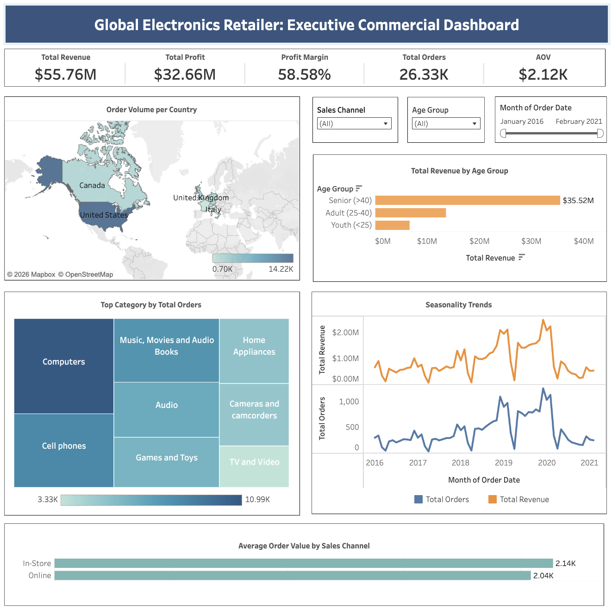

# Global Electronics Retailer Audit: Uncovering Revenue Drivers & Operational Efficiency

Scaling a global electronics retail business is tough. You have to balance online and in-store sales strategies while making sure your supply chain doesn't collapse during massive holiday volume spikes.

This project is a **Commercial Audit** aimed at doing three things: identifying customer purchasing patterns, measuring the financial impact of seasonality, and evaluating logistics health. The end goal is to equip executive management with a data-driven blueprint for a more stable, year-round growth strategy.

The dataset was obtained from Maven Analytics: [**Dataset Source (Maven Analytics)**](https://mavenanalytics.io/guided-projects/global-electronics-retailer)

### The Business Questions

This audit is driven by four core questions critical to the company's growth strategy:
1. What types of products does the company sell, and where are the primary customer bases located?
2. Are there any identifiable seasonal patterns or trends impacting order volume and revenue?
3. How long is the average delivery time, and has the logistics performance changed over time?
4. Is there a measurable difference in the Average Order Value (AOV) between online and in-store sales channels?

### How I Built This

Transforming messy, historical transaction data into a visual story requires a solid pipeline. Here is how I approached the workflow:

1. **Data Cleaning & Transformation (SQL):** I used Google BigQuery to sanitize thousands of transaction records. The biggest roadblock? Inconsistent data types. I cast the `Order Date` and `Delivery Date` columns from raw strings to `DATETIME` formats to unlock accurate time-series analysis.
2. **Metric Engineering:** The raw dataset lacked order-level commercial metrics. I engineered a custom **Average Order Value (AOV)** metric using SQL by dividing `Total Revenue` by the `Count Distinct of Order Number`.
3. **Dimensionality Reduction:** The `Customer Age` data was too granular for macro-level analysis. I utilized `CASE WHEN` clauses to group these into strategic demographic buckets (*Youth, Adult, Senior*).
4. **Interactive Dashboarding:** I designed an *Executive Dashboard* in Tableau Public. By implementing a clean *Card UI* and strict visual hierarchy, I made it easy for C-Level executives to slice the data independently without losing the business context.

### What the Data Says (The Findings)

After a deep dive into the numbers, here is what stands out:

* **Market Dominance & Portfolio:** The United States acts as the absolute anchor for this business (generating up to 14.22K total orders), with strong secondary support from Canada and the UK. Product-wise, **Computers** heavily dominate the portfolio, leaving all other categories far behind.
* **The Q4 Dependency Trap:** The business exhibits aggressive seasonality. Revenue and order volumes reliably skyrocket during the fourth quarter (November–December). The downside? A severe cash flow drop-off as the business enters Q1 and Q2 of the following year.
* **Supply Chain Resilience:** Despite the chaotic volume spikes every holiday season, global delivery times have successfully stabilized at an average of **4 days**. The logistics infrastructure has proven to be highly resilient.
* **The Sales Channel Paradox:** Physical, in-store transactions consistently yield a higher *Average Order Value* (\$2.14K) compared to online purchases (\$2.04K). This highlights a missed opportunity: without physical interaction, digital cross-selling is currently leaving money on the table.

### Strategic Recommendations (For Management)

1. **Fortify Q4 Inventory:** Given the massive reliance on year-end performance, the company must secure Computer inventory allocations in US and European distribution centers no later than late Q3 to avoid holiday stock-outs.
2. **Close the Digital AOV Gap:** Deploy dynamic bundle pricing algorithms on the e-commerce site (e.g., auto-suggesting a discounted mouse/keyboard when a laptop is added to the cart). This digitally replicates the natural upselling experience found in physical stores.
3. **Off-Peak Market Penetration:** To stabilize cash flow during the quiet Q1-Q3 months, initiate promotional campaigns for mid-tier, non-computer products (like Home Appliances or Audio). Target these campaigns toward growing secondary markets like Australia.

## 📊 Dashboard Preview

> **Interactive Version:** [View the Live Google Data Studio Dashboard Here](https://datastudio.google.com/reporting/fa952fc2-3cd4-4353-b6b3-6b2d91f87861)

---
**David Sebastian Aritonang**  
Data Analyst | Turning messy data into strategic business decisions.  
Email: [davidsebastianartt@gmail.com](mailto:davidsebastianartt@gmail.com)  
LinkedIn: [linkedin.com/in/david-sartt](https://www.linkedin.com/in/david-sartt/) 
